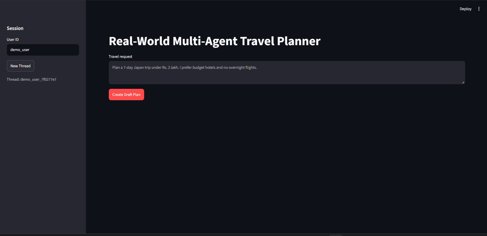
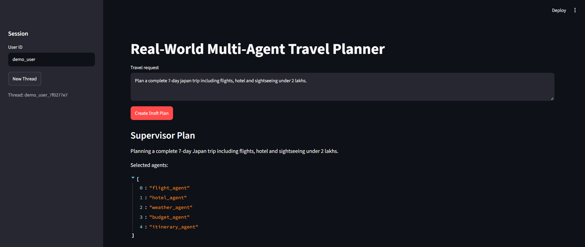
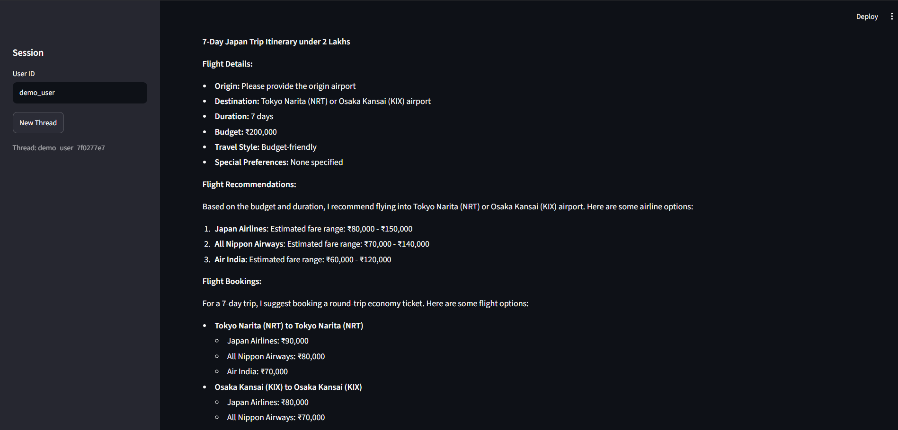
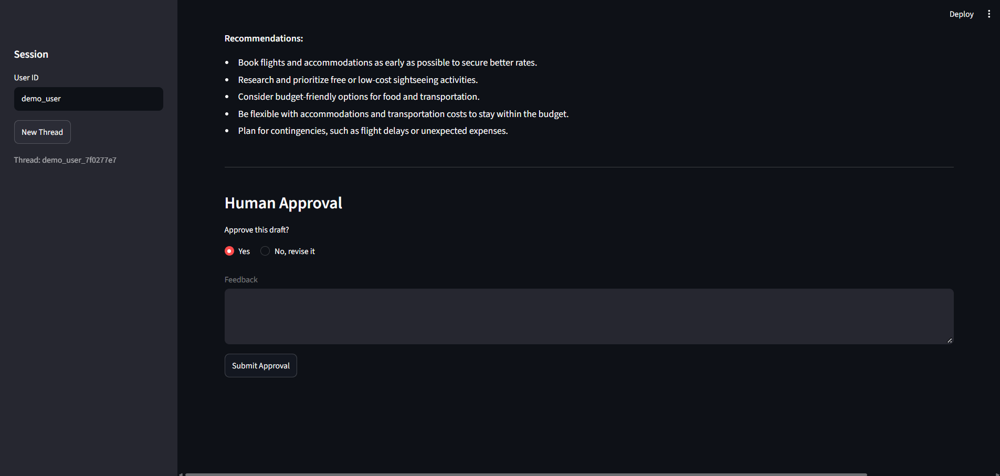
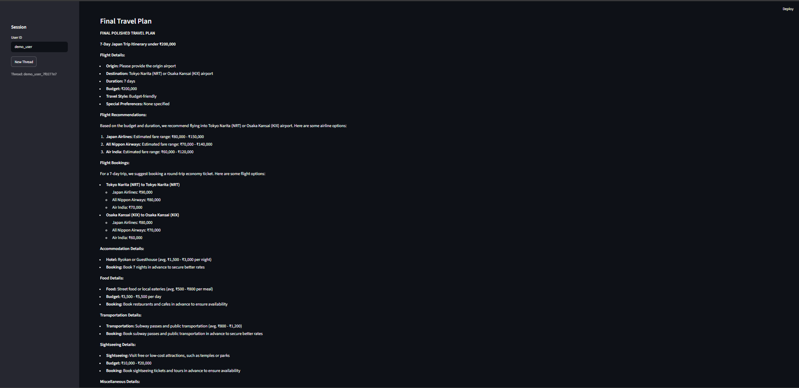

# ✈️ Real-World Multi-Agent Travel Planner

An AI-powered **Multi-Agent Travel Planning System** built using **LangGraph**, **LangChain**, **MCP**, and **Ollama**. The application coordinates multiple specialist agents to create practical travel plans using flight, hotel, weather, budget, and itinerary information with a **Human-in-the-Loop approval process**.

---

## 🚀 Features

* 🤖 Multi-Agent Workflow using LangGraph
* 🧑‍💼 Intelligent Supervisor Agent
* ✈️ Flight & Airport Information
* 🏨 Hotel & Accommodation Research
* 🌤️ Current Weather & Forecast
* 💰 Budget Analysis & Cost Feasibility
* 🗺️ Automated Travel Itinerary Generation
* 👤 Human-in-the-Loop Itinerary Approval
* 🔄 Conditional Agent Routing
* 🔌 MCP Tool Integration
* 🧠 Local LLM using Ollama
* 💾 PostgreSQL Checkpointing
* 🖥️ Interactive Streamlit UI

---

## 🛠️ Tech Stack

* Python
* LangGraph
* LangChain
* Ollama
* Llama 3.2
* Model Context Protocol (MCP)
* Tavily
* AviationStack
* Weather API
* PostgreSQL
* Streamlit

---

# 🏗️ Architecture

```text
                    User Request
                         │
                         ▼
                 Supervisor Agent
                         │
                  Agent Selection
                         │
        ┌────────────────┼────────────────┐
        ▼                ▼                ▼
  Flight Agent      Hotel Agent      Weather Agent
        │                │                │
        └────────────────┼────────────────┘
                         ▼
                   Budget Agent
                         │
                         ▼
                  Itinerary Agent
                         │
                         ▼
                  Human Approval
                    │         │
                  Yes         No
                    │         │
                    ▼         ▼
              Final Response  Revision
                    │
                    ▼
              Final Travel Plan
```

---

# 📸 Screenshots

## Travel Planner Dashboard

Interactive Streamlit interface for entering travel requirements and creating a draft travel plan.



---

## Supervisor Agent

The Supervisor analyzes the request and selects the required specialist agents.


---

## Travel Plan & Agent Results

Displays the generated travel information including flight recommendations, hotels, and other planning details.



---

## Human Approval

The generated itinerary is presented for human review and approval before generating the final response.



---

## Final Travel Plan

Final polished travel plan generated after the human approval process.



---

## Multi-Agent Workflow Output

Complete workflow output showing the final travel planning results generated by the multi-agent system.



# ⚙️ Workflow

1. User enters a travel request.
2. Supervisor Agent analyzes the request.
3. Relevant specialist agents are selected.
4. Flight Agent collects flight and airport information.
5. Hotel Agent searches for accommodation information.
6. Weather Agent retrieves current weather and forecast.
7. Budget Agent evaluates estimated costs and feasibility.
8. Itinerary Agent creates the draft travel itinerary.
9. Human reviews and approves or requests changes.
10. Final Response Agent generates the final travel plan.

---

# 🔌 MCP Integration

The project uses **Model Context Protocol (MCP)** to connect the agents with external tools and real-world data sources.

### MCP Tools

* 🔎 Tavily Search
* ✈️ AviationStack
* 🌤️ Weather API

The MCP client dynamically loads and invokes the required tools during the workflow.

---

# 👤 Human-in-the-Loop

Before generating the final travel plan, the system pauses and asks the user to review the generated itinerary.

```text
Draft Itinerary
      ↓
Human Review
      ↓
 ┌────┴────┐
 │         │
Approve   Revise
 │         │
 ▼         ▼
Final    Feedback
Response   ↓
           └──→ Updated Plan
```

---

# 💾 Persistence

The application supports **PostgreSQL-based checkpointing** using LangGraph's `PostgresSaver`, allowing graph state to be persisted across sessions.

---

# 📂 Project Structure

```text
Real-World-Multi-Agent-Travel-Planner/
│
├── app.py
├── agent.py
├── graph.py
├── state.py
├── config.py
├── mcp_client12.py
├── custom_weathermcp.py
│
├── screenshots/
│   ├── 1.png
│   ├── 2.png
│   ├── 3.png
│   ├── 4.png
│   └── 5.png
│
├── requirements.txt
├── .env
└── README.md
```

---

# ▶️ Installation

```bash
git clone https://github.com/Vinay3606/Real-World-Multi-Agent-Travel-Planner.git

cd Real-World-Multi-Agent-Travel-Planner

pip install -r requirements.txt
```

### Configure Environment Variables

Create a `.env` file:

```env
TAVILY_API_KEY=your_tavily_api_key
AVIATION_STACK_API=your_aviationstack_api_key
WEATHER_API_KEY=your_weather_api_key
DATABASE_URL=your_postgresql_database_url
OLLAMA_MODEL=llama3.2:3b
```

### Start Ollama

```bash
ollama pull llama3.2:3b
ollama serve
```

### Run Application

```bash
streamlit run app.py
```

---

# 💡 Example Request

```text
Plan a 7-day Japan trip under ₹2 lakh.
I prefer budget hotels and no overnight flights.
```

The system automatically identifies the required agents, gathers relevant information, generates a draft itinerary, and asks for human approval.

---

# 📌 Future Improvements

* 🔎 Advanced Travel Search
* 🧠 RAG-based Travel Knowledge Base
* 🗺️ Interactive Maps
* 💳 Real-time Price Tracking
* 🛫 Live Flight Availability
* 🏨 Real-time Hotel Booking
* 🤖 More Advanced AI Agents
* 🌐 Multi-language Travel Planning
* 🚀 Cloud Deployment

---

# 👨‍💻 Author

**Vinay Choudhary**

* GitHub: https://github.com/Vinay3606
* LinkedIn: https://www.linkedin.com/in/vinay-choudhary-3a6286288
